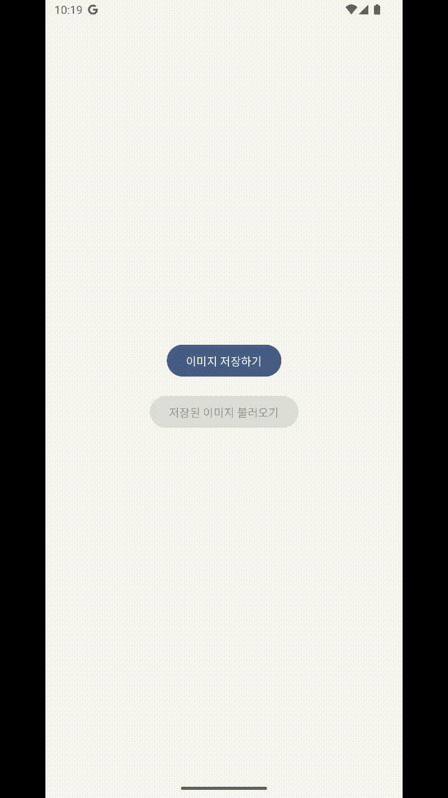

안드로이드에서의 저장소는 크게 `내부 저장소`, `외부 저장소` 로 나뉘어 관리하고 있다. 외부 저장소는 하나의 공용 저장소로 사용되는 공간으로, 쉽게 안드로이드 폰에서 내 파일과 같은 파일탐색기에서 볼 수 있는 저장 공간으로 생각하면 쉽다. 이러한 외부 저장소에도 Private 하게 개별 앱을 위한 별도의 공간이 있는데 이들을 간단하게 정리해보면 아래와 같다.

# 안드로이드 10(Q) 이전과 이후
안드로이드 버전 10 에서는 새로운 __Scope Storage__ 정책이 나오게 되었다. 기존 10버전 이전에는 앱이 디바이스 파일에 접근하기 위해 저장소 권한`(READ_EXTERNAL_STORAGE, WRITE_EXTERNAL_STORAGE)`만 얻으면 가능했지만 이를 보안상의 이유로 __다른 앱의 공용공간에 접근이 불가능__ 하도록 막아두었다. 

```kotlin
// 권한만 얻는다면 외부 저장소 접근이 안드로이드 9이하에서는 동작
<uses-permission android:name="android.permission.WRITE_EXTERNAL_STORAGE"/>
<uses-permission android:name="android.permission.READ_EXTERNAL_STORAGE"/>

// 직접 경로로 파일 생성 가능
val sdCard = Environment.getExternalStorageDirectory()
val dir = File(sdCard.absolutePath + "/MyFolder")
dir.mkdirs() // 가능
```

안드로이드 10부터는 보안과 프라이버시 강화를 위해 Scoped Storage가 도입되었다. 가장 주요한 변화는 아래와 같다. 
- 앱은 자신의 전용 디렉토리 외에는 직접 파일 경로로 접근 불가
- MediaStore API를 통한 미디어 파일 접근
- Storage Access Framework(SAF)를 통한 문서 접근

> `AndroidManifest.xml 파일에 `requestLegacyExternalStorage` 를 임시로 저장하여 안드로이드 10 이전 버전의 저장소 구조와 사용권한을 사용할 수 있지만 언젠가 없어질 Flag일 수 있으므로 되도록이면 사용하지 않고 OS 버전에 맞게 사용하는 것이 좋을 것 같다.

## 공용공간 접근(Media Type(사진 및 동영상, 음악))

기존 안드로이드 10 이전까지 File 객체로 경로를 지정하면 사용할 수 있었던 방식은 MediaStore를 통해서 지정된 Scope 즉, 각 타입에 맞게 MediaStore의 URI를 통해 접근해야 한다. 다른 앱의 전용공간에는 파일을 생성하지 못하기 떄문에 기존에 사용하였던 `WRITE_EXTERNAL_STORAGE` 권한 없이 파일을 생성할 수 있다.

```kotlin
// MediaStore의 주요 컬렉션
object MediaStoreCollections {
    // 이미지 저장소 (ex. Pictures, DCIM)
    val images = MediaStore.Images.Media.EXTERNAL_CONTENT_URI
    
    // 비디오 저장소
    val videos = MediaStore.Video.Media.EXTERNAL_CONTENT_URI
    
    // 오디오 저장소
    val audio = MediaStore.Audio.Media.EXTERNAL_CONTENT_URI
    
    // 다운로드 (Android 10+, 별도의 타입 제안이 없음)
    val downloads = MediaStore.Downloads.EXTERNAL_CONTENT_URI
}
```

## 공용공간 접근(이외 파일)
공용 미디어 파일들 중에 `Downloads`의 경우는 타입 제한은 없지만 직접 저장 보단 [SAF(Storage Access Framework)](https://developer.android.com/training/data-storage/shared/documents-files?hl=ko)를 통해 읽고 쓰는 것이 좋다고 한다. 

## 다른 앱과 파일을 공유 (FileProvider)
안드로이드에서 앱간 데이터 공유는 ContentProvider를 사용해야 한다. 앱과 파일을 공유해야할 기능이 있다면 `FileProvider` 를 이용해 파일에 접근할 수 있는 Uri를 만들고, 공유 받을 앱에 Uri 접근 권한을 허용해야 한다.

`FileProvider` 는 [`file://` 대신 `content:://`](https://www.youtube.com/watch?v=oIn0MZQJpp0&t=859s)만 사용하도록 하여 안전하게 앱 들간에 파일을 공유할 수 있도록 하는 클래스로. 이는 안드로이드 7(N)에서 도입된 것으로 보안적인 요소에 따라 추가되었다.

> file:// URI를 사용하면 앱 내부 또는 외부 파일 경로를 직접 노출하여 사용하는 다른 앱은 파일 경로에 직접 접근 하게 된다. -> 이는 파일 시스템 구조를 드러내기 떄문에 보안에 취약하다. 간단하게만 보더라도 백업 파일이나 내부 logs, sqlite 파일이 포함되면, 정보 유출로 이어질 수 있다.

### AndroidManifest.xml에 설정하기
ContentProvider를 정의하기 위해 <provider> 요소를 추가한다.

```xml
<provider
    android:name="androidx.core.content.FileProvider"
    android:authorities="${applicationId}.provider"
    android:exported="false"
    android:grantUriPermissions="true" >
    <meta-data
        android:name="android.support.FILE_PROVIDER_PATHS"
        android:resource="@xml/file_paths" />
</provider>
```

- `android:name` : 기존 제공 FileProvider 클래스를 사용하도록 한다. 이는 상황에 맞게 앱 내에서 ContentProvider를 상속 받아 만들어 사용할 수도 있다. (기본적으로 파일만 공유할 경우 만들어진 FileProvider를 쓰는것이 편하다)
- `android:authorities` : 고유한 권한을 지정한다. 일반적으로 ${applicationId} 를 prefix로 붙여 사용한다.
- `android:exported` : false로 설정하여 다른 앱이 직접 FileProvider에 접근하지 못하도록 금지한다.
- `android:grantUriPermissions` : true로 설정하여 다른 앱에 URI 권한을 부여할 수 있도록 한다.
- `android:resource` : 공유될 파일 경로를 지정하는 XML 리소스 파일이다.

### 경로 정의
FileProvider가 접근할 수 있는 디렉토리와 파일을 정의한다.

```xml
<?xml version="1.0" encoding="utf-8"?>
<paths>
    <external-path name="images" path="Pictures/"/>
</paths>
```

여기서 name과 path는 옵션은 아래와 같다.

- name : URI 내 가상 폴더 이름 (content://authority/images/...)
- path : 실제 파일 시스템 하위 디렉토리 (Pictures/ 등)

# MediaStore 사용해 외부저장소 사용하기
인터넷에서 가져온 이미지를 가져 오기전에 사전에 AndroidManifest.xml 에 파일에 권한을 추가해둔다.

```xml
<uses-permission android:name="android.permission.INTERNET" />
```

먼저 ContentValues를 생성 해주는 함수로 간단한 함수를 작성 하여 `이미지 저장` 을 해보자. ContentValues() 에서는 `MediaStore.MediaColums.*` 를 설정할 수 있는데, DISPLAY_NAME, MIME_TYPE 등을 통해 파일을 찾을 때 입력했던 정보를 Colunm(열)로 사용하여 검색할 수 있다.

```kotlin
    private fun createContentValues(fileName: String): ContentValues {
        return ContentValues().apply {
            put(MediaStore.MediaColumns.DISPLAY_NAME, fileName)
            put(MediaStore.MediaColumns.MIME_TYPE, "image/jpeg")

            if (Build.VERSION.SDK_INT >= Build.VERSION_CODES.Q) {
                put(MediaStore.MediaColumns.RELATIVE_PATH, getRelativePath())
                put(MediaStore.MediaColumns.IS_PENDING, 1)
            }
        }
    }
```

> 여기서 IS_PENDING는 안드로이드 10 이상을 실행하는 기기에서 Flag 값을 1로 설정하여 독점 액세스 권한을 얻을 수 있다. 이는 Flag 값이 다시 0이 되기 전까지는 이 앱에서만 파일 을 볼 수 있도록 한다.

## ContentResolver
앱과 Android 시스템의 콘텐츠 제공자 사이의 다리 역할을 한다. 이를 통해 DB 조회처럼 insert, query 등 많은 메소드들을 사용할 수 있다.

```kotlin
// Context를 통해 ContentResolver 획득
val contentResolver = context.contentResolver
```

간단하게 예시로 이미지는 간단하게 Bitmap 하나의 예시를 가지고 저장 하고 불러오도록 해보자.

먼저 ContentResolver에서 저장하기 위해 MediaStore의 Uri 경로를 얻어 오도록 하자

```kotlin
private fun getMediaStoreUri(): Uri {
    return if (Build.VERSION.SDK_INT >= Build.VERSION_CODES.Q) {
        MediaStore.Images.Media.getContentUri(MediaStore.VOLUME_EXTERNAL_PRIMARY)
    } else {
        MediaStore.Images.Media.EXTERNAL_CONTENT_URI
    }
}
```

이제 contentResolver insert를 통해 얻어온 Uri를 통해 FileDescriptor를 생성할 수 있다. 이러한 FileDesciptor를 통해 FileOutputStream을 얻어 Bitmap을 저장하도록 하자

여기서 저장 이후이는 위에서 설명한 IS_PENDING flag 값을 0으로 바꿔줌으로써 다른 앱에서도 파일을 볼 수 있도록 한다.

이미지를 가져오기 위해서 Uri를 통해 InputStream을 열고 Bitmap으로 변경해보도록 하자.

```kotlin
suspend fun saveImage(bitmap: Bitmap, fileName: String): Result<Uri> {
    return withContext(Dispatchers.IO) {
        try {
            val contentValues = createContentValues("$fileName.jpg")
            val imageUri: Uri?

            // URI 생성
            imageUri = contentResolver.insert(getMediaStoreUri(), contentValues)
                ?: throw IOException("생성 실패")

            // 이미지 저장
            val fileDescriptor = contentResolver.openFileDescriptor(imageUri, "w")
            fileDescriptor?.use { descriptor ->
                val outputStream = FileOutputStream(descriptor.fileDescriptor)
                if (!bitmap.compress(Bitmap.CompressFormat.JPEG, 100, outputStream)) {
                    throw IOException("Failed to compress bitmap")
                }
            }

            // Android 10 이상: 저장 완료 표시
            if (Build.VERSION.SDK_INT >= Build.VERSION_CODES.Q) {
                contentValues.put(MediaStore.MediaColumns.IS_PENDING, 0)
                contentResolver.update(imageUri, contentValues, null, null)
            }
            Result.success(imageUri)

        } catch (e: Exception) {
            Log.e("MediaStoreImageManager", "이미지 저장 실패: ${e.message}", e)
            Result.failure(e)
        }
    }
}

suspend fun loadImage(uri: Uri): Result<Bitmap> {
    return withContext(Dispatchers.IO) {
        try {
            contentResolver.openInputStream(uri)?.use { inputStream ->
                val bitmap = BitmapFactory.decodeStream(inputStream)
                    ?: throw IOException("이미지 Decode 실패")
                Result.success(bitmap)
            } ?: Result.failure(IOException("InputStream Open 실패"))
        } catch (e: Exception) {
            Result.failure(e)
        }
    }
}
```

지정한 Pictures 경로에 저장된것을 볼 수 있다. 구글 공식 문서에서 많은 ContentResolver 사용법이 있어 이를 보고 다양하게 사용하면 될것 같다.




- - -
# References 
- [Storage](https://source.android.com/docs/core/storage?hl=ko)
- [공유 저장소 미디어 파일에 액세스](https://source.android.com/docs/core/storage?hl=ko)