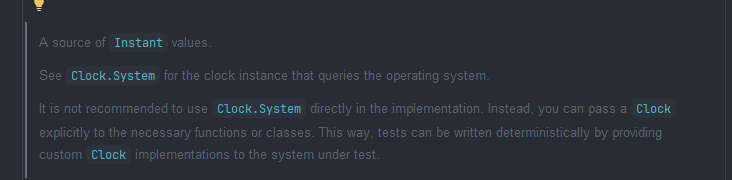

> 안드로이드나 멀티플랫폼에서 다국어 / 다국가 서비스를 만들다 보면 날짜·시간 때문에 한 번쯤은 꼭 삽질을 하게 된다. 이번 글에선 태블릿에 내장 서버를 구축하면서 발생한 Timezone 이슈를 해결하며 사용한 kotlinx-datetime을 공유하려고 한다.

## 📌 절대적인 시간 (UTC)
시간은 내가 현재 위치하고 있는 국가에 따라 다르기 때문에 이를 함께 공유하는 시간이 필요한대 이를 정의한 값이 UTC이다.   
UTC는 Universal Time Coordinated의 약자로 세계 협정시를 의미한다. 이를 통해 각 국가마다 절대적인 시간 UTC 기준 +@ 시간으로 Timezone이 계산되며 한국의 경우 잘 알려진 UTC +9:00이다.   
이를 종합해보면 서버의 DB에서는 통일된 UTC 값을 사용하고 이를 클라이언트에서 보여줄 시 국가에 맞는 Timezone을 적용하여 알맞게 보여주는 것이 중요하다.

## kotlinx-datetime 라이브러리
날짜와 시간을 하나씩 보기전에 kotlinx-datetime 라이브러리를 추가한다.

```kotlin
[versions]
datetime = "0.7.1" // 최신 버전

[libraries]
kotlinx-datetime = { module = "org.jetbrains.kotlinx:kotlinx-datetime", version.ref = "datetime" }
```

### ⏱️ Clock Instance



기본적으로 Java를 사용할때는 `System.currentTimeMillis()` 를 사용하여 절대 시간을 가져온다. kotlinx-datetime에서는 Clock 객체를 통해 System의 Instant를 가져와 Epoch 시간으로 가져올 수 있다.   
kotlinx-datetime는 kotlin 언어 및 멀티플랫폼을 지원하여 날짜/시간 관련 기능은 해당 라이브러리 사용을 많이 하고 있다. 

둘은 공통적으로 `EpochTime` 을 가져온다는 것인데 여기서 EpochTime은 __1970-01-01T00:00:00Z(UTC)__ 부터의 경과 시간을 나타내는 Long 값이다. 여기서 Long 타입의 값은 사람이 보기에 코드의 가독성이 떨어지기 때문에 이를 사용할때는 절대적인 값으로 시간과의 비교를 할때 사용하는 것이 좋다.

```kotlin
val now = Clock.System.now() // UTC 기준 Instant
val timeMillis = now.toEpochMilliseconds() // 시간에 대한 Long 값
```

### ➡️ Instant → LocalDateTime
LocalDateTime은 Clock의 Instant에서 가져올 수 있는데 사용자에게 시간을 보여주려면 반드시 TimeZone을 적용해야 한다. 이때 `TimeZone` 객체에서 UTC, 각 국가 및 currentSystemDefault()를 통해 TimeZone들을 가져올 수 있다.   
현재 코드를 작성하는 시점 UTC와 Timezone을 적용한 시간을 테스트 해보면 아래와 같다.

```kotlin
val now = Clock.System.now() 
val localDateTimeUtc = now.toLocalDateTime(TimeZone.UTC)
val localDateTime = now.toLocalDateTime(TimeZone.currentSystemDefault()) // Timezone 적용 (현재 서울)
// LocalDateTime (UTC) : 2026-01-20T12:18:48.326
// LocalDateTime (현재 Default -> 한국(UTC+9:00)) : 2026-01-20T21:18:48.326
```

### ⬅️ LocalDateTime → Instant
이렇게 LocalDateTime을 다시 Instant로 되돌릴 때에도 Timezone이 들어간다.

> ⚠️ 여기서 헷갈리기 쉬운 포인트는 toInstant는 `UTC` 기준으로 동작한다. 따라서 toInstant로 변환 시 LocalDateTime이 어떤 TimeZone 기준에서 왔는지를 알려줘야한다. 
> 따라서 toInstant에서 Timezone에 한국을 설정 했다면 이는 "한국 기준이였구나" 를 알려주어 한국기준인 UTC(-9:00)를 적용해서 돌려준다.

```kotlin
val now = Clock.System.now() 
val localDateTime = now.toLocalDateTime(TimeZone.currentSystemDefault()) // Timezone 적용 (현재 서울)
val instant = localDateTime.toInstant(TimeZone.currentSystemDefault()) // "한국 기준으로 다시 되돌려줌"

// instant == now
```

### DST (Daylight saving time)
시간대를 알아보며 알게된 내용 중 DST는 일광 절약 시간제를 의미하며 시계(표준시)를 한 시간 당겨서 사용한다. 이는 kotlinx-datetime을 사용하면 자동으로 나라별 UTC에 적용된다.

- - -
## References
- [https://www.epochconverter.com/](https://www.epochconverter.com/)
- [https://github.com/Kotlin/kotlinx-datetime](https://github.com/Kotlin/kotlinx-datetime)
- [협정 세계시 (UTC)](https://namu.wiki/w/%ED%98%91%EC%A0%95%20%EC%84%B8%EA%B3%84%EC%8B%9C)