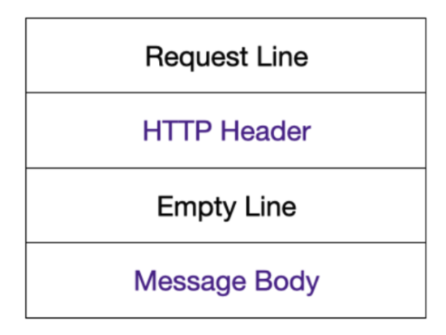

> 모바일 개발을 진행하다 보면 이미지, 동영상과 같이 파일을 업로드 하는 경우가 생기기 마련이다. 이때 `Multipart` 라는 개념을 처음 접하게 된다. 이전에 안드로이드 네트워크 라이브러리로 Retrofit을 사용했던 경험을 토대로 Multiplatform 사용하고 있는 Ktrofit 라이브러리에서 사용하는 방법을 보려고 한다.

# Multipart

모바일 개발에서 이미지 업로드를 구현하다 보면 "Multipart로 보내야 한다"는 것을 찾아보게 된다. 

`Multipart`는 여러 개의 데이터를 하나의 HTTP 요청에 포함시키는 방식으로, 보통 파일 업로드나 데이터를 여러 부분으로 나누어 서버에 전달할 때 사용된다. 이 방식은 `Content-Type: multipart/form-data` 헤더를 사용하여 데이터가 여러 파트로 나누어져 전송된다는 것을 서버에 알린다.

이 개념은 웹에서 파일 업로드를 처리하는 데 많이 사용되며, 이미지, 비디오, 오디오 파일과 같은 바이너리 데이터를 HTTP를 통해 서버로 전송할 때 사용하는 방법이다. 각 파트는 특정 형식으로 나누어지며, 이 방식은 데이터를 다른 형식(예: 텍스트, 파일 등)으로 혼합하여 전송할 수 있도록 한다.

## multipart/form-data




HTTP Request에는 위와 같이 4가지 파트로 나눌 수 있다.

HTTP 통신에는 헤더로 `Content-Type`을 지정하게 되는데 이는 리소스의 미디어 타입을 나타내기 위해 사용된다. 기본적으로 사용하는 CRUD를 살펴보면 헤더는 `application/json` 을 사용하는데 이는 json 타입임을 나타낸다. (요즘은 json 형태로 서버와 데이터를 주고 받아 자연스럽게 사용중인듯 하다)

이와 같이 `multipart/form-data` 는 __file__ 을 업로드 하기 위해서 사용되는 Type이다. 이름과 같이 이 형식의 요청은 각 파트별로 분리하여 개별 파일의 정보를 얻게 된다.

Multipart 요청을 보낼 때는 `POST` HTTP 메소드를 사용해서 보낸다. 이때 Boundary라는 것을 통해 각 파트별로 분리할 수 있도록 하여 서버에서 각각 데이터를 읽을 수 있게 된다.

> Boundary? : 파일을 첨부할 때 브라우저가 생성한 값으로, 여러 파일이 전송되었을때 이를 구분하기 위해서 사용된다. 

# 방법 알아보기

현재 개발중인 서비스는 안드로이드와 Desktop에서 사용할 수 있도록 개발하고 있으며 네트워크 라이브러리로 Ktor와 Ktorfit을 사용하고 있다. 먼저 Ktor에서는 [공식문서](https://ktor.io/docs/client-requests.html#upload_file)에 `submitFormWithBinaryData` 를 사용하면 된다고 한다. 프로젝트에서는 Ktorfit을 골자로 사용하고 있으므로 이를 더 살펴보도록 하겠다.

Ktorfit의 [공식문서](https://foso.github.io/Ktorfit/requests/#multipart)에서는 두가지 방법을 알려주고 있다.

<h4>1. @Body</h4>

```kotlin
interface ExampleService {
    @POST("upload")
    suspend fun upload(@Body map: MultiPartFormDataContent)
}
```

@Body 어노테이션이 붙은 `MultiPartFormDataContent` 타입의 파라미터를 사용한다.

```kotlin
val multipart = MultiPartFormDataContent(formData {
    append("description", "Ktor logo")
    append("image", File("ktor_logo.png").readBytes(), Headers.build {
        append(HttpHeaders.ContentType, "image/png")
        append(HttpHeaders.ContentDisposition, "filename=ktor_logo.png")
    })
})

exampleApi.upload(multipart)
```

<h4>2. @Multipart</h4>

```kotlin
@Multipart
@POST("upload")
suspend fun uploadFile(@Part("description") description: String, @Part("") file: List<PartData>): String
```

함수에 @Multipart 어노테이션과 @Part 어노테이션을 붙은 파라미터를 사용하면 해당 어노테이션이 붙은 파라미터들은 MultiPartFormDataContent 형태로 합쳐저 보내게 된다.

```kotlin
val multipart = formData {
    append("image", File("ktor_logo.png").readBytes(), Headers.build {
        append(HttpHeaders.ContentType, "image/png")
        append(HttpHeaders.ContentDisposition, "filename=ktor_logo.png")
    })
}

exampleApi.upload("Ktor logo",multipart)
```

## 문제 발생
처음에는 두 번째 방식인 @Multipart를 붙여 구현하려 했지만 __Required request part 'file' is not present__ 이라는 에러를 계속 마주했다 😭. 해당 에러는 파일이 서버로 넘어오지 않았을때 발생한다고 되어있어 확인했지만 문제되는 코드는 없었다. 

계속 Multipart에 필요한 Content-Type, Content-Disposition 등을 바꾸거나 여러가지를 시도했지만 계속 똑같은 에러가 발생했는데, ktorfit 공식 github에서 하나의 issue를 찾게 되었다..!.


해당 issue를 생성한 개발자분도 같은 문제로 @Multipart 방법은 되지 않고 `@Body` 를 사용한 MultiPartFormDataContent만 된다는 내용이 있었다.

> 라이브러리를 사용할때 내부 코드나 해당 오픈소스를 잘 살펴봐야겠다..! (혹시 @Multipart를 사용해도 문제가 없으신 분은 알려주시면 감사하겠습니다! 🙇🏻)

# 구현 간단하게 살펴보기

현재 Android와 Desktop에서 동작하는 서비스를 개발하고 있어 File에 대해 다른점이 있었다. Android의 경우 이미지, 동영상과 같은 파일은 contentResolver를 통해 uri 형태로 가져오게 되고 Desktop의 경우 File의 형태로 가져올 수 있다. 

Desktop의 경우 JFileChooser와 같이 파일 선택기를 사용할 수 있고 Android의 경우 Content Uri를 가져오는 방식은 서비스 마다 다르게 [사진 선택 도구](https://developer.android.com/training/data-storage/shared/photopicker?hl=ko) 나 ContentProvider로 가져올 수 있다.

Multipart 업로드에 초점을 맞춰 Uri와 File을 받아온 이후부터 업로드하는 부분만 확인해 보자!

먼저 각 플랫폼에 맞게 필수로 필요한 값들을 다음과 같이 정의하여 추가하였다.
> 1. File의 ByteArray
> 2. MIME type

```kotlin
expect class PlatformFile {
    fun toByteArray(): ByteArray
    fun getMimeType(): String
}

// Android
actual class PlatformFile(
    private val uri: Uri?,
    private val contentResolver: ContentResolver
) {
    actual fun toByteArray(): ByteArray {
        return uri?.let { contentResolver.openInputStream(it)?.readBytes() } ?: byteArrayOf()
    }

    actual fun getMimeType(): String {
        return uri?.let { contentResolver.getType(it) }.orEmpty()
    }
}


// Desktop
actual class PlatformFile(
    private val file: File?
) {
    actual fun toByteArray(): ByteArray {
        return file?.readBytes() ?: byteArrayOf()
    }

    // probeContentType -> mimeType을 가져온다
    actual fun getMimeType(): String {
        return file?.let { Files.probeContentType(it.toPath()) }.orEmpty()
    }
}


안드로이드의 경우 Compose를 사용하여 개발하고 있는데 화면에서 다음과 같이 `ContentResolver`를 가져올 수 있다.

@Composable
fun Screen() {
    val context = LocalContext.current
    val contentResolver = context.contentResolver
    // 사용하는 곳에서 넘겨주기
}
```

## 1. Body 방식으로 파일 업로드
이제 MultipartDataContent로 업로드를 하면된다.

```kotlin
@POST
suspend fun uploadFile(
    // other parameter
    @Body file: MultiPartFormDataContent
)

// 사용하는 Repository 코드에서
suspend fun postUploadFile(
    byteArray: ByteArray,
    mimeType: String
) {
    val extension = mimeType.substringAfter("/")
    val multipart = MultiPartFormDataContent(
    formData {
        // 서버에서 지정한 "key" 값
        append("{your_key}", byteArray, Headers.build {
            append(HttpHeaders.ContentType, mimeType)
            append(HttpHeaders.ContentDisposition,  "filename={file_name}.$extension")
        })
    })
    {yourService}.uploadFile(multipart)
}
```

# References

- [https://jw910911.tistory.com/117](https://jw910911.tistory.com/117)
- [https://foso.github.io/Ktorfit/](https://foso.github.io/Ktorfit/)