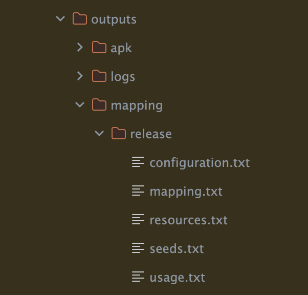

- - -
> 안드로이드에서 앱을 Release할 때 코드 난독화와 최적화는 필수로 적용해야한다. 이번 글에서는 난독화를 적용한 Release 빌드를 적용하면서 알게된 Kotlin DSL (build.gradle.kts) 환경에서 ProGuard/R8 설정하고, 실전에서 자주 마주치는 문제를 해결하는 방법을 정리해보려 한다.

# 📌 ProGuard / R8이란?

`ProGuard`는 자바 클래스 파일을 축소(obfuscation), 최적화(optimization), 난독화(shrinking) 해주는 툴이다.
안드로이드 빌드 시 `proguard-rules.pro` 파일을 통해 설정할 수 있으며, 다음과 같은 기능을 제공한다.

<h3>➡️ ProGuard의 4가지 핵심 기능</h3>

1. Shrinking (축소): 사용하지 않는 클래스, 메서드, 필드를 제거하여 불필요한 코드 제거로 APK/AAB 크기 감소
2. Optimization (최적화): 바이트코드 최적화로 성능 향상, 사용하지 않는 코드 블록 제거, 함수 인라이닝, 상수 계산 등을 수행
3. Obfuscation (난독화): 클래스/메서드/필드 이름을 짧고 의미 없는 이름으로 변경
4. Preverification (사전 검증): 자바의 바이트코드를 JVM/ART에서 유효한지 미리 검증

> 참고: Android Gradle Plugin 3.4 이상부터는 ProGuard 대신 R8이 기본 난독화 도구로 사용된다. R8는 ProGuard 규칙과 호환되므로 이 글의 모든 설정을 그대로 사용할 수 있다. 즉, `minifyEnabled true` 옵션을 활성화하면, 이제는 내부적으로 R8이 동작한다.

<h3>➡️ R8 특징</h3>

- *ProGuard + D8(Dex 컴파일러)* 통합 → 컴파일 속도 ↑
- 규칙 파일(`proguard-rules.pro`)은 그대로 사용 가능
- 대부분의 기존 ProGuard 설정이 그대로 호환됨

다음과 같은 라이브러리를 사용할 경우 ProGuard 설정이 필요하다.

- `Reflection(리플렉션)` 기반 라이브러리 (ex: Gson, Jackson, H2 DB, ORMLite, Room)
- `Annotation Processing` 사용하는 경우 (ex: Hilt, Room)
- `Native 코드 호출(JNI)` 이 포함된 경우

> 👉 이유: 난독화 과정에서 리플렉션으로 접근되는 `클래스/메서드/필드`가 이름이 변경되어버리면 런타임에 정상 동작하지 않을 수 있기 때문. → 따라서 해당 클래스/필드/메서드를 `-keep` 옵션 등으로 보존해야 한다. 
>
> 가장 흔히 사용되는 안드로이드를 개발시 DTO를 위해 @Serializable를 많이 사용하게 되는데 이런 DTO class들은 -keep을 적용해 줘야한다.

# 📌 build.gradle.kts에서 기본 설정

1. 기본 Release 빌드 설정 

```kotlin
// app/build.gradle.kts
...

android {
  ...
    buildTypes {
        release {
            // 1. 코드 축소 및 난독화 활성화
            isMinifyEnabled = true
            
            // 2. 리소스 축소 활성화 (APK 크기 감소)
            isShrinkResources = true
            
            // 3. ProGuard 규칙 파일 지정
            proguardFiles(
                // Android 기본 최적화 규칙
                getDefaultProguardFile("proguard-android-optimize.txt"),
                // 커스텀 규칙 파일
                "proguard-rules.pro"
            )
        }
    }
}
```

추가적인 Rules는 `proguard-rules.pro` 파일에 작성하면 된며 여기서 코드의 축소나 난독화를 진행할때 적용되는 Option들을 설정할 수 있다.

## ProGuard 주요 옵션들

| 옵션              | 설명                                        |
| ----------------- | ------------------------------------------- |
| -keep             | 난독화/삭제 방지(클래스, 메서드, 필드 유지) |
| -keepclassmembers | 클래스는 난독화 가능, 특정 멤버만 유지      |
| -dontwarn         | 특정 패키지의 경고 무시                     |

## 와일드카드와 필터링

ProGuard / R8 규칙(`proguard-rules.pro`)에서 클래스, 메서드, 필드 등을 지정할 때 **와일드카드와 예약 키워드**를 활용하여 훨씬 짧고 유연하게 작성할 수 있다.

### ➡️ 주요 와일드카드

| 문법 | 의미 | 예시 |
|------|------|------|
| `*` | 임의의 **한 수준 이름** (클래스명, 메서드명, 필드명) | `com.example.*` → `com.example` 패키지의 모든 클래스 |
| `**` | 임의의 **전체 경로** (여러 패키지 포함 가능) | `com.example.**` → `com.example` 및 하위 모든 패키지 |
| `***` | 임의의 **타입(type)** (리턴 타입, 파라미터 타입 등) | `public *** get*(...)` → 모든 타입의 `get*` 메서드 |
| `...` | 임의의 **개수의 인자** | `void set*(...)` → 파라미터 개수/타입 무관한 `set*` 메서드 |


### ➡️ 메서드/필드 예약어

| 예약어 | 의미 | 예시 |
|--------|------|------|
| `<methods>` | 모든 메서드 | `-keepclassmembers class * { <methods>; }` |
| `<fields>` | 모든 필드 | `-keepclassmembers class * { <fields>; }` |
| `<init>` | 생성자 | `-keepclassmembers class * { <init>(...); }` |

```proguard
-keep class com.example.myapp.** { <methods>; }
→ com.example.myapp 하위 모든 클래스의 모든 메서드 보존
```

# 📌 난독화 결과 확인 및 테스트
release 빌드를 실행 후 빌드 산출물에는 다음의 파일들이 생성된다.

```bash
./gradlew assembleRelease
```



앱을 빌드 후 생성되는 `outputs/mapping/release` 폴더에는 많은 txt 파일이 생성되는데 이는 난독화 적용 이후 `크래시 분석`에 필수로 사용된다. 여기서 각 파일이 담고 있는 내용은 아래와 같다.

-	`mapping.txt` → 난독화된 이름과 원래 이름 매핑 (크래시 분석 필수).
-	`seeds.txt` → 유지된 클래스/메서드 목록 (-keep 규칙 적용 결과).
-	`usage.txt` → 제거된 코드 목록 (최적화 결과 확인용).
-	`configuration.txt` → 최종 빌드에 적용된 규칙 전체 집합.
- `resources.txt` -> 리소스 최적화 결과 (삭제/유지된 리소스 기록)

> 현재 새로운 Android Studio 버전 Narwhal 3 Feature에서는 proguard Inspection을 불 필요한 룰이 적용되어 있는지 검사하는 기능이 추가된 것으로 보인다.

`youtube: https://www.youtube.com/shorts/OMVt7ApADwc`

# References
- [앱 최적화 사용 설정](https://developer.android.com/topic/performance/app-optimization/enable-app-optimization?hl=ko&_gl=1*1ullkps*_up*MQ..*_ga*MTI1MzY4OTIzNy4xNzU5MTUxOTQx*_ga_6HH9YJMN9M*czE3NTkxNTE5NDAkbzEkZzAkdDE3NTkxNTE5NDAkajYwJGwwJGgyMDE3NTA3Njgw)
- [보관 교칙 추가](https://developer.android.com/topic/performance/app-optimization/add-keep-rules?hl=ko)