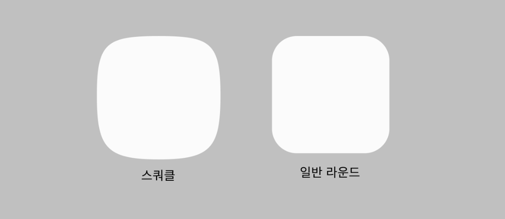
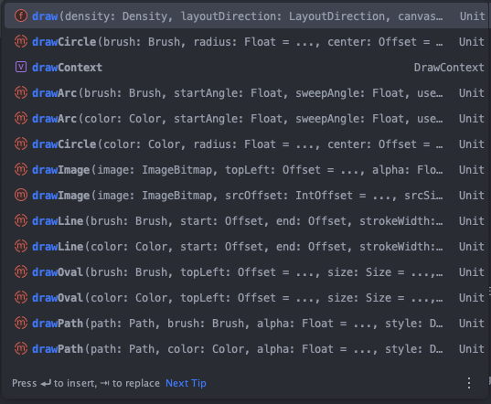
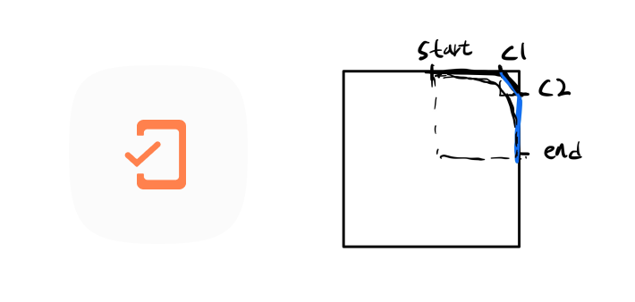
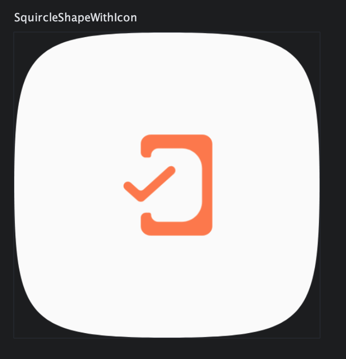

> 사이드 프로젝트 중 스쿼클 모양을 디자인에 구현해야 하는 상황이 생겨, Compose의 Custom View를 활용하여 해당 화면을 구현하며 학습한 내용을 정리하고자 합니다.

# 스쿼클?



스쿼클은 정사각형과 원의 중간 형태로, `정사각형`과 `원`의 합성어이다. 위의 이미지에서 볼 수 있듯이, 일반적인 라운드 처리된 사각형과 비교하면 더 부드러운 곡률로 연결된 것을 알 수 있다.

Compose에서는 `Canvas` 스코프 내에서 `draw`라는 접두사가 붙은 함수를 활용해 커스텀 UI를 그릴 수 있다.



일반적인 선으로 이루어진 Chart 화면, 그래프와 같은 경우는 `Path()` 와 `drawPath()` 를 사용하여 그리면 될 것이다. 하지만 스쿼클의 경우 곡선 처리가 되어 있어 쉽지 않을 것이다.

## Bezier Curve
> Bezier Curve는 부드러운 곡선을 만드는데 이용되고 있으며, CAD, 컴퓨터 그래픽등 컴퓨터 환경에서 널리 쓰인다.
>
> (🗣️ TMI: 학부 시절 컴퓨터 그래픽스 수업에서 Bezier Curve를 배웠던 기억이 문득났다.)

Bezier Curve는 `조절점(Control point)` 를 사용해 직선을 점차 기울여 곡선을 만드는 방식이다. 이 조절점은 n개가 있을 수 있으며, n개일때를 `n-1차 Bezier Curve` 라고 한다.

아래의 영상에서 Bezier Curve를 간략하게 설명하고 있으니 참고하면 좋습니다!

`youtube: https://www.youtube.com/embed/pnYccz1Ha34?si=Ownd81WYKoXqXcFG`

요약하자면
- 1차 Bezier Curve는 t가 0에서 1로 이동하면서 조절점 하나가 직선을 이루는 방식이다.
- 2차는 조절점 두 개를 사용해 곡선을 그리며, 조절점이 많아질수록 더욱 복잡한 곡선을 그릴 수 있다.

Compose에서는 Bezier Curve를 그리기 위한 여러 함수를 제공하며, `quadraticBezierTo()`는 2차, `cubicTo()`는 3차 Bezier Curve를 그릴 수 있다.

```kotlin
fun quadraticBezierTo(x1: Float, y1: Float, x2: Float, y2: Float)

/**
    * Adds a quadratic bezier segment that curves from the current
    * point to the point at the offset ([dx2], [dy2]) from the current point,
    * using the control point at the offset ([dx1], [dy1]) from the current
    * point.
    */
fun relativeQuadraticBezierTo(dx1: Float, dy1: Float, dx2: Float, dy2: Float)

/**
    * Adds a cubic bezier segment that curves from the current point
    * to the given point ([x3], [y3]), using the control points ([x1], [y1]) and
    * ([x2], [y2]).
    */
fun cubicTo(x1: Float, y1: Float, x2: Float, y2: Float, x3: Float, y3: Float)

/**
    * Adds a cubic bezier segment that curves from the current point
    * to the point at the offset ([dx3], [dy3]) from the current point, using
    * the control points at the offsets ([dx1], [dy1]) and ([dx2], [dy2]) from the
    * current point.
    */
fun relativeCubicTo(dx1: Float, dy1: Float, dx2: Float, dy2: Float, dx3: Float, dy3: Float)
```

> `cubicTo()` 함수는 3개의 정점을 받게 되는데 이는 3차 베지어 곡선으로 앞의 점 3개를 이용하여 2차 베지어 곡선을 그리고, 나머지 3개의 점으로 다시 2차 베지어 곡선을 그린 것을 선형 보간하는 방식으로 그려진다.

## 스쿼클 그리기

[스쿼클을 웹사이트](https://cubic-bezier.com/#.17,.67,.83,.67)에서 미리 시물레이션 해볼 수 있는 사이트가 있어 혹시 그리게 될 디자인이 있다면 조절점들을 이동하며 확인해 보고 구현할 수 있다.



스쿼클을 그리기 위해 조절점들을 start, c1, c2, end로 잡아 (start ~ c2), (c1 ~ end) 를 이용해서 그리도록 구상했다. 이 과정을 반복하여 전체 도형을 완성하도록 하자.


```kotlin
Preview
@Composable
fun SquircleShapeWithIcon(
    modifier: Modifier = Modifier.size(200.dp),
    backgroundColor: Color = Color(0xFFFBFBFB),
    content: @Composable () -> Unit = {
        Icon(
            modifier = Modifier.size((200 / 3).dp),
            tint = Color(0xFFFF814D),
            painter = painterResource(id = R.drawable.icon_student_check),
            contentDescription = null
        )
    },
) {
    Box(
        modifier = modifier,
        contentAlignment = Alignment.Center
    ) {

        Canvas(
            modifier = Modifier.fillMaxSize()
        ) { // 원하는 크기
            val width = size.width
            val height = size.height

            val path = Path().apply {
                // 시작점 (상단 중앙)
                moveTo(width / 2, 0f)

                // 상단 오른쪽 코너
                cubicTo(
                    width.times(0.95f), 0f, // 첫 번째 컨트롤 포인트
                    width, height.times(0.05f), // 두 번째 컨트롤 포인트
                    width, height / 2 // 도착점
                )

                // 오른쪽 아래 코너
                cubicTo(
                    width, height.times(0.95f), // 첫 번째 컨트롤 포인트
                    width.times(0.95f), height, // 두 번째 컨트롤 포인트
                    width / 2, height // 도착점
                )

                // 아래쪽 왼쪽 코너
                cubicTo(
                    width.times(0.05f), height, // 첫 번째 컨트롤 포인트
                    0f, height.times(0.95f), // 두 번째 컨트롤 포인트
                    0f, height / 2 // 도착점
                )

                // 왼쪽 위 코너
                cubicTo(
                    0f, height.times(0.05f),
                    width.times(0.05f), 0f,
                    width / 2, 0f
                )

                close()
            }

            drawPath(
                path = path,
                color = backgroundColor
            )
        }
        content()
    }
}
```
위 코드는 Slot API 형식을 사용하여 Preview용 Icon을 삽입한 코드로 결과는 아래와 같다.



# References
- [https://namu.wiki](https://namu.wiki/w/%EB%B2%A0%EC%A7%80%EC%97%90%20%EA%B3%A1%EC%84%A0)
- [https://cubic-bezier.com/#.17,.67,.83,.67](https://cubic-bezier.com/#.17,.67,.83,.67)
- [https://charlezz.com/?p=46274](https://charlezz.com/?p=46274)
- [https://woongsios.tistory.com/70](https://woongsios.tistory.com/70)
- [https://www.youtube.com/watch?v=pnYccz1Ha34](https://www.youtube.com/watch?v=pnYccz1Ha34)
