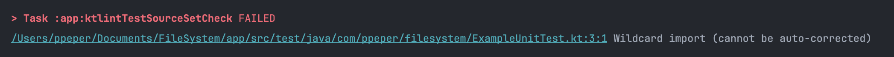
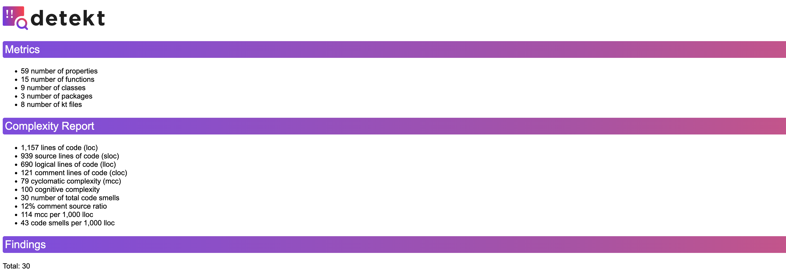

코드 포맷팅을 점검해야 하는 일이 있어 이전에 Kotlin에서 많이 사용하는 코틀린 정적 분석 도구인 `ktlint`와 `Detekt`를 보았던 것이 기억나 한번 적용해 보며 어떤 기능이 있는지 살펴보려고 한다.

- - -

# 📌 ktlint와 Detekt는 뭐가 다른가

둘 다 코틀린 코드를 정적으로 분석해주는 도구라 이름만 보면 비슷해 보이는데, 실제로 잡아주는 문제의 결이 다르다.

| 구분 | ktlint | Detekt |
|---|---|---|
| 목적 | 코드 __포맷팅/스타일__ 강제 (Kotlin 공식 코딩 컨벤션 기준) | 코드 __복잡도/잠재 버그__ 탐지 |
| 대표 검사 | 들여쓰기, 줄바꿈, import 순서, 세미콜론, trailing comma | 긴 함수, 복잡한 조건문, 매직 넘버, 사용하지 않는 private 함수 |
| 자동 수정 | `ktlintFormat`으로 대부분 __자동 수정 가능__ | 자동 수정 거의 불가 (구조적인 문제라 직접 고쳐야 함) |
| 룰 커스터마이징 | `.editorconfig` 로 최소한만 조정 (공식 스타일 강제가 목적) | `detekt.yml` 로 룰 단위 세밀하게 on/off, threshold 조정 가능 |

> 👉 정리하면 ktlint는 "이 코드가 코틀린 스타일 가이드를 지켰는가", Detekt는 "이 코드가 유지보수하기 좋은 구조인가"를 본다. 그래서 둘은 경쟁 관계가 아니라 **같이 쓰는 게 기본값**이다.

---

# 📌 ktlint 동작 살펴보기

## 설치

```kotlin
// build.gradle.kts (root)
plugins {
    id("org.jlleitschuh.gradle.ktlint") version "12.1.1"
}

ktlint {
    version.set("1.3.1")
    android.set(true) // 안드로이드 코틀린 스타일 가이드 적용
    ignoreFailures.set(false)

    reporters {
        reporter(org.jlleitschuh.gradle.ktlint.reporter.ReporterType.HTML)
        reporter(org.jlleitschuh.gradle.ktlint.reporter.ReporterType.CHECKSTYLE)
    }
}
```

여기 있는 옵션들이 원래 기본값인지 아닌지 헷갈려서, 플러그인 소스의 `KtlintExtension.kt`까지 찾아봤다.

| 옵션 | 기본값 | 그대로 둬도 되는가 |
|---|---|---|
| `version` | 플러그인이 내부에 번들한 특정 버전 (플러그인 버전마다 달라짐) | 굳이 안 적어도 동작은 하지만, 플러그인을 올릴 때 ktlint 버전도 같이 딸려 올라가버린다. 버전을 고정하고 싶어서 명시했다 |
| `android` | __`false`__ | 기본값이 꺼져 있다. 안드로이드 프로젝트인데 이걸 안 켜면 import 순서 등에서 순수 Kotlin 스타일 가이드로 검사돼서, `true`로 반드시 명시해야 한다 |
| `ignoreFailures` | __`false`__ | 이미 기본값이 `false`라 사실 안 적어도 똑같이 동작한다. "위반 있으면 빌드 실패시킨다" 는 옵션으로 알고 있으면 된다. |
| `reporters` | 비어 있음 | 콘솔에 위반을 찍어주는 건 이 옵션과 무관하게 항상 켜져 있다. `reporters{}`는 그 위에 `build/reports/ktlint/`로 남는 HTML/XML 같은 __파일 리포트__ 를 추가하는 옵션이라, 안 적으면 콘솔 로그만 남고 파일 리포트는 안 생긴다 |

## .editorconfig로 규칙 설정하기

플러그인만 붙여도 기본 룰(`ktlint_official` 스타일)로 바로 동작하긴 하는데, 룰을 켜고 끄거나 프로젝트 스타일에 맞게 조정하려면 Gradle이 아니라 `.editorconfig`에 등록해서 쓴다. ktlint는 `.editorconfig`를 파일에 선언된 규칙을 사용하여 코드 스타일을 검사한다. 해당 파일은 기본적으로 생성해주어야 하며 프로젝트 `root` 위치에 만들어 사용하면 된다. 

```ini
# .editorconfig (프로젝트 루트)
root = true

[*.{kt,kts}]
indent_size = 4
indent_style = space
insert_final_newline = true
max_line_length = 120
ij_kotlin_allow_trailing_comma = true
ij_kotlin_allow_trailing_comma_on_call_site = true

# 기준이 되는 스타일 프리셋
ktlint_code_style = ktlint_official

# 특정 룰만 끄기
ktlint_standard_no-wildcard-imports = disabled
ktlint_standard_filename = disabled

# 아직 정식이 아닌 실험적 룰셋 켜기
ktlint_experimental = enabled
```

주요 옵션으론 아래와 같다.

| 옵션 | 역할 |
|---|---|
| `ktlint_code_style` | 기준 스타일 프리셋 (`ktlint_official`, `android_studio`, `intellij_idea`) |
| `ktlint_standard_<rule-id>` | `standard` 룰셋의 특정 룰 on/off (`disabled` / `enabled`) |
| `ktlint_experimental` | 아직 정식이 아닌 실험적 룰셋 전체 on/off |
| `max_line_length` | 한 줄 최대 길이 |
| `ij_kotlin_allow_trailing_comma(_on_call_site)` | trailing comma 허용 여부 |
| `insert_final_newline` | 파일 끝 개행 강제 |

## 기본 명령어
ktlint에서 제공하는 명령어에서는 기본적으로 `ktlintCheck`와 ktlintFormat`이 있다. ktlintCheck의 경우 코드의 앞서 설정한 코드의 스타일을 검사하여 오류가 있는 부분을 체크하며 ktlintFormat의 경우 코드의 스타일 검사 후 자동으로 틀린 부분을 수정해준다.

안드로이드 프로젝트를 처음 생성하면 기본적으로 Test 파일에 와일드 카드로 import 되어있는 파일이 있다. `ktlint_standard_no-wildcard-imports` 옵션을 enabled하게 되면 와일드 카드를 확인하기 때문에 ktlintCheck를 돌려보면 실패하는 것을 테스트 해볼 수 있다.



다시 disabled를 하고 ktlintCheck를 해보면 정상적이게 통과 하는 것을 볼 수 있다. 이러한 옵션들로 현재 프로젝트에 맞게 옵션들을 설정해서 이를 CI에 등록해서 commit전에 사용하면 좋을 것 같다.

```text
$ ./gradlew ktlintCheck
> Task :app:ktlintTestSourceSetCheck

BUILD SUCCESSFUL in 15s
```

# 📌 Detekt 동작 살펴보기

## 설치

root/app 같은 멀티 모듈 구조에서는 보통 플러그인 버전은 root에서 `apply false`로 선언하고, 실제 적용은 app 모듈에서 한다.

```kotlin
// build.gradle.kts (root)
plugins {
    id("io.gitlab.arturbosch.detekt") version "1.23.7" apply false
}
```

```kotlin
// app/build.gradle.kts
plugins {
    id("io.gitlab.arturbosch.detekt")
}

detekt {
    buildUponDefaultConfig = true
    allRules = false
    config.setFrom(file("$rootDir/config/detekt/detekt.yml"))
    // config = files("$rootDir/config/detekt/detekt.yml")
}
```

## 설정 옵션 정리 (`config/detekt/detekt.yml`)

Detekt는 `detekt.yml` 하나로 전역 설정과 룰셋(rule set)별 설정을 관리한다. 자주 쓰는 것만 간단히 정리하면 이 정도다.

| 옵션 | 역할 |
|---|---|
| `build > maxIssues` | 허용 가능한 최대 이슈 개수. 0이면 하나라도 있으면 빌드 실패 |
| `config > validation` | 설정 파일에 오타난 키가 있으면 에러로 알려줌 |
| `output-reports` | html/xml/sarif 등 파일로 남길 리포트 종류 (아래에서 다룬다) |
| `complexity`, `style`, `naming`, `exceptions` 등 룰셋 | 룰셋마다 `active`(켜짐 여부)와 `threshold`, `ignore*` 같은 세부 옵션을 갖는다 |

전체 룰과 옵션 목록은 아래 공식 문서에 다 정리되어 있어 찾아보고 적용하면 될 것 같다.

- [Detekt Configuration 공식 문서](https://detekt.dev/docs/introduction/configurations/)
- [Detekt Rule Sets 공식 문서](https://detekt.dev/docs/rules/complexity)

## 예제로 여러 옵션 한 번에 테스트하기

옵션이 실제로 어떻게 동작하는지 보려고, 지금 프로젝트에 적용해둔 실제 `config/detekt/detekt.yml`을 그대로 쓰되 `baseline`만 잠깐 꺼서 프로젝트 전체를 다시 훑어봤다.

```yaml
# config/detekt/detekt.yml
build:
  maxIssues: 0
  excludeCorrectable: false

config:
  validation: true
  warningsAsErrors: false

output-reports:
  active: true
  exclude:
    - 'TxtOutputReport'

complexity:
  LongParameterList:
    functionThreshold: 3
    constructorThreshold: 3

style:
  MagicNumber:
    active: true
    ignoreNumbers: ['-1', '0', '1', '2']
  ReturnCount:
    active: true
    max: 2

naming:
  FunctionNaming:
    functionPattern: '[a-z][a-zA-Z0-9]*'
    ignoreAnnotated: ['Composable']

exceptions:
  TooGenericExceptionCaught:
    active: true
    exceptionNames:
      - 'Exception'
      - 'RuntimeException'
```

```bash
./gradlew detekt
```

## 리포트 뽑아보기

콘솔 로그만으로는 위반이 몇 개인지, 어떤 룰이 자주 걸리는지 한눈에 보기 어려울 수 있지만 이를 위해 report 파일 생성도 지원하고 있다.

```yaml
output-reports:
  active: true
  exclude:
    - 'TxtOutputReport'
```

`TxtOutputReport`만 빼고 나머진 기본값 그대로 두고, `./gradlew detekt`를 돌리면 `app/build/reports/detekt/` 아래에 `detekt.html`, `detekt.xml`, `detekt.sarif`, `detekt.md`가 같이 생긴다. 그중 `detekt.html`을 브라우저로 열어보면 위반한 내용을 쭉 볼 수 있다.



---

# References
- [ktlint github](https://github.com/ktlint/ktlint)
- [ktlint Gradle Plugin](https://github.com/JLLeitschuh/ktlint-gradle)
- [Detekt 공식 문서](https://detekt.dev/)
- [Detekt - Configuration](https://detekt.dev/docs/introduction/configurations/)
- [Detekt - Rule Sets](https://detekt.dev/docs/rules/complexity)
- [Detekt GitHub](https://github.com/detekt/detekt)

